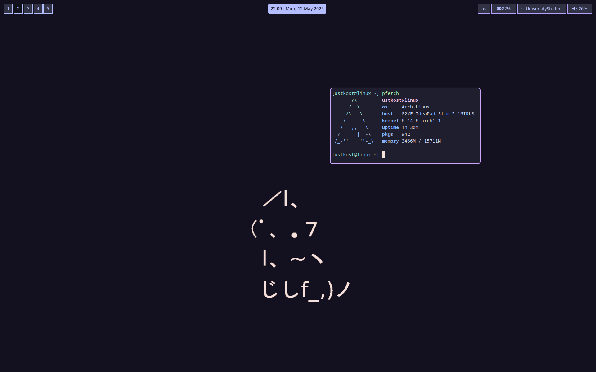
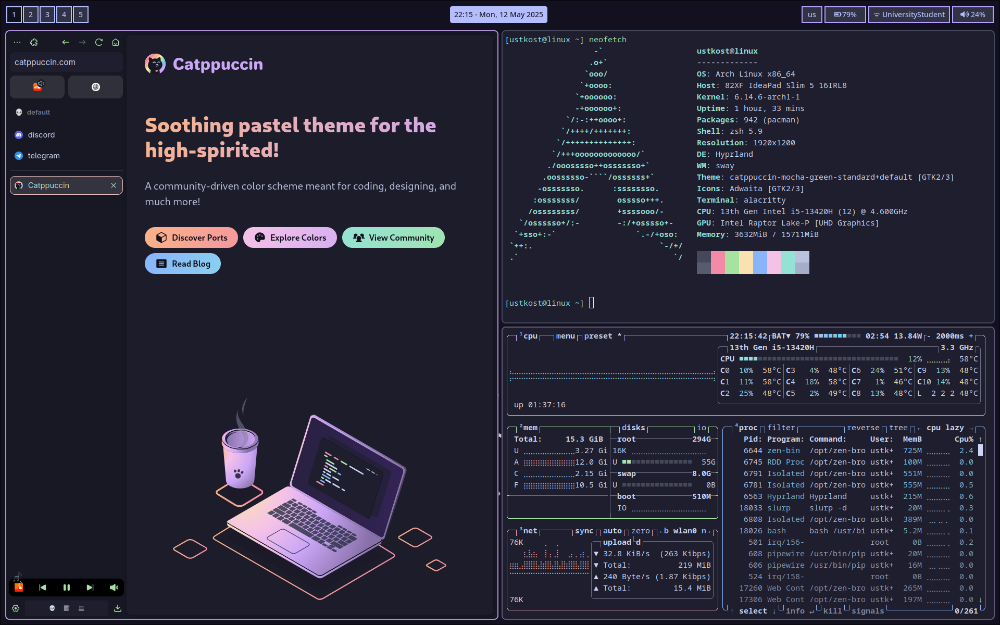

# dotfiles
This is my minimalistic Arch Linux dotfiles for Hyprland with Catppuccin (Mocha flavor) colorscheme

For dependencies you can refer to `packages.txt` file

## Contents
- Hyprland
- Neovim
- Alacritty
- Zsh
- Waybar
- Wofi
- Hyprlock
- Gtk
- Btop
- Dunst
- Hypridle
